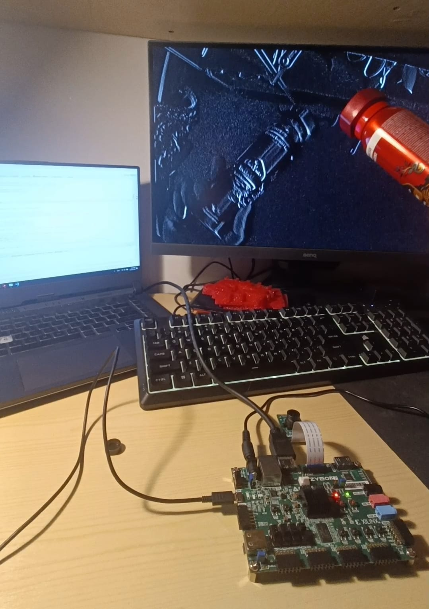

# FPGA Camera Filters

## Overview
This project implements real-time camera filters on the Zybo Z7-20 FPGA using the PCam 5C camera module. The design leverages the Zynq-7000 SoC to apply various image processing filters efficiently.

## Features
- **Grayscale Filter** – Converts an image to shades of gray.
- **Inverted Filter** – Applies a negative effect by reversing pixel values.
- **Edge Detection Filter** – Identifies boundaries using the Sobel operator.
- **Gaussian Blur Filter** – Smooths images to reduce noise.
- **Real-Time Processing** – High-speed video processing with AXI-Stream architecture.
- **Hardware Optimization** – Efficient use of FPGA resources, including DSP and BRAM.

## Architecture
- **Camera Input:** MIPI CSI-2 interface for high-speed video streaming.
- **Processing Pipeline:** AXI-Stream-based implementation for parallel processing.
- **Filter Selection:** Switch-based dynamic filter selection at runtime.
- **Output:** HDMI display for real-time filtered video visualization.

## Getting Started
### Hardware Requirements
- Zybo Z7-20 FPGA Board
- PCam 5C Camera Module
- HDMI Display

- All details about the implemntation is available in the Documentation

